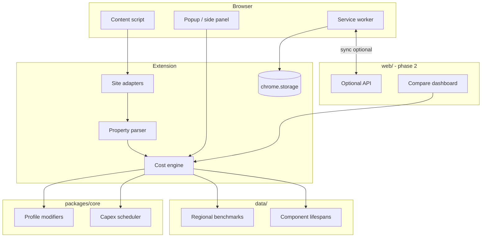

# Architecture

## Overview

List Price Plus is a **monorepo** with a shared TypeScript calculation engine consumed by a browser extension and (later) a web app.



## Packages

### `packages/core`

Pure TypeScript. No DOM, no `chrome.*` APIs.

**Exports:**

- `estimateMonthlyCosts(property, profile, options)` → `CostEstimate`
- `scheduleCapex(property, asOfDate)` → `CapexEvent[]`
- Types: `PropertyFacts`, `UserProfile`, `CostBreakdown`, `ConfidenceLevel`

Unit-tested heavily; this is the product's brain.

### `extension`

Manifest V3 WebExtension.

| Part | Responsibility |
|------|----------------|
| **Content scripts** | Detect listing pages; run site adapter; inject UI |
| **Site adapters** | Zillow (v1), Redfin/Realtor (later) — map DOM → `PropertyFacts` |
| **Popup / side panel** | Profile settings, enable/disable, link to docs |
| **Service worker** | Persist settings; optional sync; update checks |

Build: **Vite** or **WXT** (recommended for multi-browser MV3) bundling `packages/core`.

### `web` (phase 2)

Static or Next.js app for:

- Account + settings backup
- Saved listings compare table
- PDF/export for investors
- Business-mode reports

Shares `packages/core` via workspace dependency.

### `data/`

Versioned JSON (or CSV → JSON build step):

- Utility $/sqft or $/kWh by climate zone and state
- Default insurance bands
- Component lifespan tables (roof, HVAC, pool pump, etc.)
- Property tax estimation fallbacks when not on page

Kept separate so non-developers can update benchmarks without touching engine code.

## Data flow (listing page)

1. Content script URL matches `*://*.zillow.com/homedetails/*` (and variants).
2. Adapter waits for DOM stability (MutationObserver + timeout).
3. Parser extracts `PropertyFacts` + confidence per field.
4. Load `UserProfile` from `chrome.storage.local`.
5. Call `estimateMonthlyCosts`.
6. Render panel (Shadow DOM for style isolation).
7. On profile change in popup, message content script to re-run.

## PropertyFacts schema (draft)

```typescript
interface PropertyFacts {
  source: 'zillow' | 'manual' | 'redfin';
  sourceUrl?: string;
  listPrice?: number;
  sqft?: number;
  beds?: number;
  baths?: number;
  yearBuilt?: number;
  lotSqft?: number;
  propertyType?: 'single_family' | 'condo' | 'townhouse' | 'multi_family' | 'other';
  hoaMonthly?: number;
  annualTax?: number;
  hasPool?: boolean;
  hasSeptic?: boolean;
  hasWell?: boolean;
  heatingType?: string;
  coolingType?: string;
  // Per-field confidence: 'page' | 'inferred' | 'default' | 'user'
  fieldProvenance?: Record<string, string>;
}
```

## Storage

| Key | Location | Contents |
|-----|----------|----------|
| `profile` | `chrome.storage.local` | UserProfile |
| `preferences` | local | Panel position, collapsed categories |
| `savedListings` | local (v1) / sync (v2) | Snapshot of PropertyFacts + estimate |

No PII required for v1. Optional account in phase 2.

## Tech stack (proposed)

| Layer | Choice | Rationale |
|-------|--------|-----------|
| Language | TypeScript | Shared types across extension + web |
| Monorepo | pnpm workspaces | Light, fast |
| Extension tooling | WXT | MV3, Firefox + Chrome from one config |
| UI (panel) | Preact or vanilla + Shadow DOM | Small bundle in content script |
| Web app | Next.js or Astro | If SEO/marketing site combined |
| Tests | Vitest | Same as Vite ecosystem |
| CI | GitHub Actions | Lint, test core, build extension artifact |

## Security & privacy

- Process listing data **locally** in the browser by default.
- No telemetry of addresses without opt-in.
- CSP-friendly injection; no `eval`.
- Minimize `host_permissions` — only supported listing domains.

## Deployment

- Extension: Chrome Web Store, Firefox Add-ons (AMO), Edge Add-ons (same CRX package often works).
- Web: Vercel/Cloudflare Pages.
- Data updates: extension fetches signed JSON manifest periodically (optional premium).
