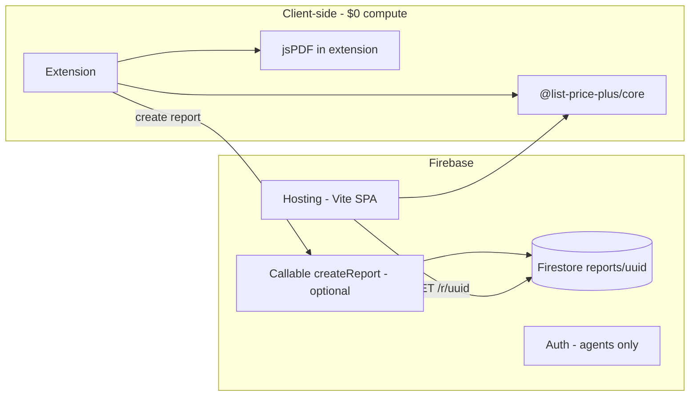

# Hosting strategy

Near-zero cost hosting for client share links, optional API, and the Vite/React companion site. **Recommendation: Google Firebase** for POC through early realtor usage.

---

## Recommendation: Firebase (yes, it wins for now)

For this project shape — static React app, occasional writes when a realtor shares a report, reads when a client opens a link — **Firebase is cheaper, simpler, and faster to ship** than Azure.

Azure can do the same things, but you will assemble more pieces (Static Web Apps + Functions + Cosmos DB or Table Storage) for no savings at low volume.

**Migration difficulty later: Low.** The valuable logic lives in `@list-price-plus/core` (TypeScript, portable). The web app is a static SPA. Firestore documents are a thin `{ uuid → report JSON }` layer — exportable to JSON, recreatable on Supabase, Azure Cosmos, or Postgres in a day if you ever outgrow Firebase.

---

## Cost comparison (idle → mom-scale → early product)

Assumptions for **realtor POC**:

- 1 agent, ~5–20 shared reports/week
- ~50–200 client link opens/month
- Engine runs **in browser** (extension + web bundle), not on every API call
- PDF generated **in extension** (no server render)

### Firebase (Spark + Blaze as needed)

| Service | Free tier (typical) | Your POC usage | Est. cost |
|---------|---------------------|----------------|-----------|
| **Hosting** | 10 GB storage, ~360 MB/day transfer | Landing + report pages | **$0** |
| **Firestore** | 1 GiB, 50K reads / 20K writes per day | Hundreds of docs/month | **$0** |
| **Auth** | 50K MAU | 1–5 agents | **$0** |
| **Cloud Functions** | 2M invocations/mo (Blaze) | Optional `createReport` | **$0** |
| **Cloud Storage** | 5 GB | Agent logos optional | **$0** |

**Blaze plan:** Required to deploy Cloud Functions, but you are billed only beyond free quotas. With no traffic, bill stays **$0**. Set a **budget alert at $5** in Google Cloud Console.

**When you might pay:** Thousands of reports/month, large PDFs stored server-side, or moving calculation to Functions on every page view.

### Azure (rough equivalent)

| Service | Free tier | Notes |
|---------|-----------|-------|
| **Static Web Apps** | 100 GB bandwidth/mo | Good for Vite deploy |
| **Azure Functions Consumption** | 1M executions/mo free | Comparable to Cloud Functions |
| **Cosmos DB free tier** | 1000 RU/s, 25 GB | Overkill to configure for uuid lookups |
| **Table Storage / Blob** | Cheap but not "one console" | More wiring |

At POC scale, Azure is also ~**$0**, but:

- More moving parts for auth + database + hosting
- Cosmos DB is easy to over-provision accidentally
- Firebase Hosting + Firestore + Auth is one console your mom's workflow fits naturally

**Verdict:** Same approximate cost at zero traffic; **Firebase wins on simplicity and integration**.

---

## Architecture on Firebase (recommended)



### What runs where

| Concern | Where | Why |
|---------|-------|-----|
| Cost calculation | Extension + web SPA | No server bill; same `@list-price-plus/core` |
| PDF for realtor | Extension | Instant download; no server |
| Share link payload | Firestore `reports/{uuid}` | Small JSON blob; public read by id |
| Agent branding | Stored in extension + copied into report doc | |
| Client view | Hosting serves SPA; `/r/:uuid` loads doc | |
| Writes | Callable Function or Firestore rules + Auth | Prevent anonymous spam writes |

### Firestore document shape (draft)

```typescript
interface SharedReport {
  id: string;                    // uuid v4
  createdAt: Timestamp;
  expiresAt: Timestamp;          // e.g. +90 days
  agentId: string;
  branding: {
    name: string;
    brokerage: string;
    phone: string;
    email: string;
    logoUrl?: string;
  };
  sourceUrl: string;
  propertyFacts: PropertyFacts;
  profileSnapshot: UserProfile;  // realtor-chosen defaults for client view
  estimate: CostEstimate;        // precomputed at share time
}
```

Client page can **display stored `estimate`** directly (fast) or re-run core from `propertyFacts` to verify (optional).

### Do you need a hosted calculator API?

**Not for v1.**

| Approach | Cost | When |
|----------|------|------|
| Bundle core in extension + web | $0 | **Now** |
| Callable Function wraps core | Free tier | If you want one canonical server-side calc |
| Dedicated API on Cloud Run / Functions | Scales with traffic | Many third-party consumers |

Share links only need a **read** from Firestore and a **static JS bundle** that renders the report.

---

## Firebase setup checklist (Phase 8)

1. Create Firebase project; enable Hosting, Firestore, Auth.
2. Upgrade to **Blaze** before Functions (budget alert $5).
3. Deploy Vite build: `firebase deploy --only hosting`.
4. Firestore rules (sketch):
   - `reports/{id}`: read if `true` (uuid is unguessable) **or** read if valid id only
   - write: **deny** client; only Admin SDK / Callable Function
5. Callable `createReport`: verify Firebase Auth agent; validate payload size; write doc; return `uuid`.
6. Extension: agent signs in once; calls callable with facts + estimate + branding.
7. Optional: Firestore TTL on `expiresAt` for auto-cleanup.

### UUID in URL vs encoding everything in GET params

| Method | Pros | Cons |
|--------|------|------|
| **`/r/{uuid}` + Firestore** | Short links; updatable; no URL length limit | Needs backend (free tier OK) |
| **Base64 JSON in query string** | Truly serverless | Huge URLs; ugly; no revoke |

**Use uuid + Firestore.** Cost is negligible; links are shareable in SMS.

---

## Azure alternative (if you prefer it)

Equivalent stack:

- **Azure Static Web Apps** → Vite React
- **Azure Functions** → `createReport`
- **Table Storage** or **Cosmos DB serverless** → uuid documents
- **Entra External ID** or Auth0 → agent login

Works fine; expect more YAML and portal hopping. Cost still ~$0 at POC scale.

---

## Other cheap options (not recommended first)

| Option | Notes |
|--------|-------|
| **Cloudflare Pages + D1/KV** | Very cheap; KV good for uuid blobs; less agent-auth tooling |
| **Supabase free tier** | Postgres + auth; great Firebase alternative; also ~$0 |
| **Vercel + Postgres** | Free hobby tier; overkill for uuid lookup |
| **Self-host on Raspberry Pi** | Not worth ops for mom's workflow |

Firebase or Supabase are the two best "free until proven" choices. Firebase edges out if you already know it.

---

## Migration path (if you leave Firebase later)

1. Export Firestore `reports` collection → JSON.
2. `@list-price-plus/core` unchanged.
3. Point web SPA at new API / DB (Supabase, Azure SWA + Table, etc.).
4. Update extension callable URL env var.
5. Old links: 301 redirect old domain or keep Firebase Hosting read-only for legacy uuids.

No vendor lock-in on the **engine**; only on stored reports.

---

## Security & abuse (minimal POC)

- Unguessable uuid (v4) for public read is standard for "anyone with link"
- Rate-limit `createReport` per agent uid
- Max payload size on Function
- Expire reports after 90 days
- Do not store client PII in reports

---

## Summary

| Question | Answer |
|----------|--------|
| Firebase or Azure for cheapest start? | **Firebase** (~same $0, less friction) |
| Need API day one? | **No** — client-side core + Firestore for shares |
| Need paid listing APIs? | **No** for POC — DOM adapters |
| When costs appear? | Store fees ($5 Chrome), domain (~$12/yr), traffic well beyond family use |
| Hard to migrate? | **No** — thin data layer, fat client-side engine |
