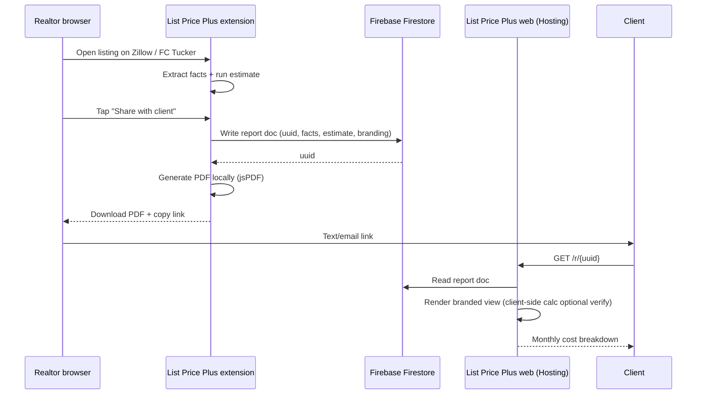
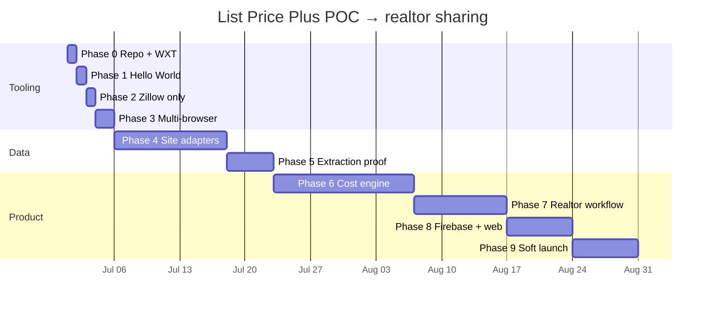

# Development roadmap

Phased plan from "Hello World" extension → multi-site data extraction → cost engine → realtor-branded client sharing. Optimized for **near-zero hosting cost** until there is real usage.

**Principles**

1. Prove extraction before building the calculator.
2. One extension codebase, multiple browsers via WXT.
3. Run the engine **client-side** first; add a hosted API only where sharing/branding requires it.
4. Ship the **realtor workflow** (one tap → link + PDF) as soon as estimates are directionally useful.

---

## Phase 0 — Repo & tooling

**Goal:** Monorepo ready for extension + shared packages.

| Task | Notes |
|------|-------|
| [x] Product documentation | `docs/` |
| [x] `git init` | |
| [x] pnpm workspace (`extension`, `packages/core`, `web`) | |
| [x] WXT scaffold in `extension/` | Hello World badge + popup |
| [x] TypeScript baseline | `tsconfig.base.json` |
| [x] Firebase project `list-price-plus` + Hosting deploy | https://list-price-plus.web.app |
| [x] Vite/React web placeholder | `/` and `/r/:id` routes |

**Exit:** `pnpm dev` loads extension in Chrome; web live on Firebase Hosting.

**Effort:** ~1 day

---

## Phase 1 — "Hello World" extension

**Goal:** Installable extension that does one visible thing on every page.

| Task | Notes |
|------|-------|
| [x] MV3 manifest via WXT | `action`, `background` service worker |
| [x] Content script injects a small badge: **"List Price Plus loaded"** | Fixed corner chip, Shadow DOM |
| [x] Popup with version + "enabled" toggle | `chrome.storage.local` |
| [x] Build artifact: `.output/chrome-mv3` | Document load-unpacked steps in `extension/README.md` |

**Exit:** Extension installs in Chrome and shows the badge on any site.

**Effort:** ~1 day

---

## Phase 2 — Zillow-only activation

**Goal:** UI appears **only** on supported listing URLs.

| Task | Notes |
|------|-------|
| [x] URL matcher: `*://*.zillow.com/homedetails/*` (and `/homedetails/` variants) | WXT `defineContentScript` matches |
| [x] Site registry: `{ id, host, pathPattern, adapter }` | `extension/adapters/registry.ts` |
| [x] On non-Zillow pages: no injection (or popup says "Go to a listing") | |
| [x] On Zillow listing: replace generic badge with **"List Price Plus · Zillow"** | |

**Exit:** Badge only on Zillow listing pages; nowhere else.

**Effort:** ~½ day

---

## Phase 3 — Multi-browser builds

**Goal:** Same source → Chrome, Edge, Firefox (Opera optional).

| Task | Notes |
|------|-------|
| [x] WXT multi-browser config | Firefox `browser_specific_settings` in `wxt.config.ts` |
| [x] `build:all` script | Chrome + Firefox from one command |
| [x] Document per-browser load steps | `extension/README.md` |
| [x] CI job: `wxt build` for all targets | `.github/workflows/ci.yml` |

**Exit:** Three browser builds from one `pnpm build:extension`; manual smoke test on each.

**Effort:** ~1–2 days

**Note:** Do this **before** heavy site adapters so you are not debugging DOM + browser differences at once.

---

## Phase 4 — Second & third site adapters

**Goal:** Prove the adapter pattern works beyond Zillow.

### Site priority

| Site | Why | Adapter difficulty |
|------|-----|-------------------|
| **Zillow** | Already in Phase 2; richest public data | Medium (SPA, embedded JSON) |
| **FC Tucker** (`fctucker.com`) | Local IN market; mom may use this | Medium (broker site, varies by template) |
| **RE/MAX** | National brand; client familiarity | Hard (many franchise subdomains) |

Start FC Tucker as one concrete broker site. RE/MAX may need a **single regional subdomain** first (e.g. one Indiana office), not all remax.com at once.

| Task | Notes |
|------|-------|
| [x] `SiteAdapter` interface in `extension/adapters/types.ts` | `extract(document, url)` |
| [x] Zillow adapter v1 | JSON-LD → embedded state → DOM fallback |
| [ ] FC Tucker adapter v1 | Inspect 2–3 listing templates; save HTML fixtures |
| [ ] RE/MAX (one office subdomain) adapter v1 | Generalize later |
| [x] Adapter version field + error UI | Panel shows missing-field warnings |
| [x] Fixture tests for Zillow parser | `adapters/zillow/v1.test.ts` |
| [ ] **API research spike** (time-boxed ½ day) | Document findings in `docs/data-sources.md` |

### APIs — realistic expectations

| Source | Free/cheap? | Verdict for POC |
|--------|-------------|-----------------|
| Zillow | No public listing API | **DOM extraction** |
| MLS / RETS | Broker-only, paid | Not for POC |
| ATTOM, CoreLogic | Paid | Later / premium |
| OpenStreetMap / Census | Free | Geography context only, not listings |
| Realtor.com | No free listing API for extensions | DOM if needed later |

**Conclusion:** For POC, **page extraction wins**. APIs are not a blocker; do not wait on them.

**Exit:** Panel lists extracted fields (price, sqft, beds, baths, year built, tax if present) with provenance labels on Zillow + FC Tucker (+ one RE/MAX site).

**Effort:** ~1–2 weeks (Zillow deepest; others follow faster)

---

## Phase 5 — Extraction proof & stability

**Goal:** Confidence that scraping is viable before investing in the engine.

| Task | Notes |
|------|-------|
| [x] Fixture tests: HTML snippets → expected `PropertyFacts` | Zillow fixtures + partial listing |
| [x] Manual checklist: 10 listings per site | [extraction-checklist.md](extraction-checklist.md) |
| [x] Confidence scoring per field | `utils/confidence.ts` + panel badge |
| [x] Manual override form in panel | Edit / Save / Reset — per-URL `chrome.storage` |
| [x] Decision doc: proceed / pivot sites | [extraction-decision.md](extraction-decision.md) |

**Exit:** ≥80% of test listings yield price + sqft + beds on Zillow — **you fill the checklist**; then Phase 6.

**Effort:** ~3–5 days (overlaps Phase 4)

---

## Phase 6 — Cost engine (`packages/core`)

**Goal:** Turn `PropertyFacts` + profile into monthly breakdown. **Runs in the extension** (no server required).

| Task | Notes |
|------|-------|
| [x] Implement `estimateMonthlyCosts` per [cost-model.md](cost-model.md) | Vitest in `packages/core` |
| [x] Wire extension panel → core | Monthly total + breakdown + capex |
| [x] Popup profiles: credit tier, thrifty/standard, down payment | `userProfile` in storage |
| [x] Capex timeline section | Upcoming major expenses |
| [x] Disclaimer + confidence badge | On cost estimate |

**Exit:** Zillow listing shows a plausible monthly total and category breakdown.

**Effort:** ~2–3 weeks

**Hosting cost:** **$0** — all client-side.

---

## Phase 7 — Realtor branded workflow (mom's use case)

**Goal:** On a listing page, realtor taps **one button** → branded **PDF** + **shareable URL** for clients.

### UX flow

| Task | Notes |
|------|-------|
| [ ] Agent profile in extension: name, photo URL, brokerage, phone, logo | `chrome.storage.local` |
| [ ] **"Share with client"** button fixed top of page (realtor-only mode toggle) | Prominent, one tap |
| [ ] Client PDF: breakdown + capex timeline + agent footer + disclaimer | **jsPDF in extension** → $0 |
| [ ] Create report: `POST` write to Firestore (or callable Function) → returns `uuid` | See [hosting.md](hosting.md) |
| [ ] Share URL: `https://{your-domain}/r/{uuid}` | |
| [ ] Web route `/r/:id` reads doc, renders read-only report | Vite/React placeholder is fine |
| [ ] Optional: short slug later | Not needed for POC |

**Exit:** Mom opens a listing, taps share, sends link + PDF to a test client; client opens link on phone.

**Effort:** ~1–2 weeks

---

## Phase 8 — Minimal web app + Firebase backend

**Goal:** Hosted client links and optional thin API; **Spark/Blaze budget ≈ $0**.

| Task | Notes |
|------|-------|
| [ ] Vite + React app in `web/` | Placeholder landing + `/r/:uuid` report page |
| [ ] Firebase project (Spark → Blaze when Functions needed) | |
| [ ] Firebase Hosting → deploy `web/dist` | Custom domain optional later |
| [ ] Firestore collection `reports/{uuid}` | Property snapshot, estimate JSON, agent branding, `createdAt`, `expiresAt` |
| [ ] Security rules: public read single doc by id; write only via authenticated agent OR signed extension token | Start: write from Function only |
| [ ] Callable Function `createReport` (optional) | Validates payload, writes Firestore |
| [ ] Firebase Auth: agent login (email magic link or Google) | Mom's account only at first |

**Engine location:** Ship `@list-price-plus/core` as npm workspace package **bundled into both extension and web**. The web report page re-runs the engine from stored facts (integrity check) — **no separate calculator API required for v1**.

Add hosted API later only if you need server-only secrets or heavy PDF rendering.

**Exit:** Production URL serves client reports; Firebase bill still ~$0 at family-scale usage.

**Effort:** ~1 week

Details: [hosting.md](hosting.md)

---

## Phase 9 — Polish & soft launch

| Task | Notes |
|------|-------|
| [ ] Privacy policy page | Required for stores |
| [ ] Chrome Web Store + Firefox AMO (unlisted or public) | $5 Chrome one-time fee |
| [ ] Error reporting (optional, opt-in) | Which adapter failed |
| [ ] Expire old report links (90 days) | Firestore TTL policy |
| [ ] Mom dogfoods for 2 weeks | Feedback → profile defaults |

**Effort:** ~1 week

---

## Phase 10 — Later (not POC)

- Pro subscription / Stripe
- Compare saved listings dashboard
- More sites (Redfin, Realtor.com)
- Remote data bundle updates
- Server-side PDF if client-side layout insufficient
- Migrate off Firebase if costs or needs change (see hosting.md)

---

## Timeline overview

*(Dates are illustrative — adjust when Phase 0 starts.)*

**Rough total:** ~8–10 weeks part-time solo to realtor-ready sharing.

---

## Decision log

| Decision | Choice | Rationale |
|----------|--------|-----------|
| Extension framework | **WXT** | Multi-browser MV3 from one repo |
| Extraction vs API (POC) | **DOM adapters** | No free listing APIs |
| Engine first deployment | **Client-side** (`@list-price-plus/core`) | $0 hosting; fast iteration |
| Share links storage | **Firestore doc per uuid** | Free tier; simple GET `/r/:id` |
| PDF generation | **Extension (jsPDF)** first | No server cost; instant for realtor |
| Backend host | **Firebase** over Azure | Cheaper/simpler at idle; see hosting.md |
| Companion web | **Vite/React placeholder** | `/r/:id` + landing only at first |

---

## Immediate next steps (start here)

1. `git init` and commit docs + skeleton.
2. Scaffold WXT in `extension/` → Hello World badge (Phase 1).
3. Restrict to Zillow URLs (Phase 2).
4. Add Firefox + Edge builds (Phase 3).
5. Spike Zillow DOM on 3 live listings; save sanitized fixtures.

When Phase 4 starts, open FC Tucker listings your mom actually uses and pick one RE/MAX office site — do not boil the ocean on all RE/MAX subdomains.

---

## Related docs

- [hosting.md](hosting.md) — Firebase vs Azure, cost model, migration
- [extension-strategy.md](extension-strategy.md) — MV3 details
- [data-sources.md](data-sources.md) — per-site extraction notes
- [cost-model.md](cost-model.md) — engine formulas (Phase 6)
- [user-profiles.md](user-profiles.md) — credit / thrift settings
